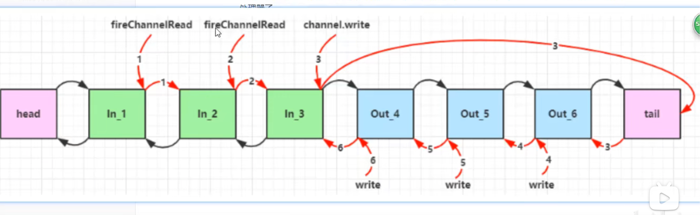

# P07

这个bytebufferUtil的功能实现是通过buffer.get(index)实现的，buffer.get()会导致position+1，但是get(index)不会

# p14
`channel.read`指的是从channel里读取，`channel.write`是向channel里写

# p16
transferTo的返回值是真实transfer的数据的大小

# p24
这个例子讲的不太好
见Server.java与client.java

# P28
见代码注释

# p29
讲的很好，重点看；
1. 如果某个事件发生了，对应的key会被加入到selectedKeys里；
2. 如果这个事件没有被处理完，下次select的时候，他还会被加入到selectedKeys里；
3. 如果这个事件处理完了，如果不手动remove，这个处理完的事件的key仍然会存在于selectedKeys之中；

# p30
视频之中，报错位置是channel.read处报错，但是在mac环境里，read不会报错，而只会返回-1

# p34
案例很好，重点看；

# p37
见WriteServer代码注释

# p38

再次重复重点说一下我理解的阻塞与非阻塞：
- 网络io过程中，有两个阶段：1. 当前数据是否准备好（准备好读、写、建立链接）；2. 进行读取与写入；
- 阻塞与非阻塞的区别，指的就是第一个阶段。
- 第二个阶段真正操作的时候，肯定都是阻塞读、阻塞写、阻塞建立链接的；
- 多路复用是阻塞还是非阻塞呢？其实我理解算是阻塞吧，因为没有准备好的时候，他就阻塞在哪。

# p47
一个channel可以同时是readable也可以同时是writable；
1. 启动server与client；
2. client连接到server，并向channel里写入一些；
3. server在accept后，向该accept之后返回的channel注册进selector并监听read和write事件；
4. server在select获取到这个channel，可以看到这个channel的isReadable和isWritable都是true；

# p49
多路复用相较于阻塞，优势就在于，少量线程可以监控多个channel的状态，并且不会死等某一个channel而导致其他channel不可用；
多路复用相较于非阻塞，优势就在于，线程不必通过多次轮询来监控channel的状态；

不存在异步阻塞！异步阻塞图一啥啊！

# p50
讲解零拷贝，讲的挺好；
`transferTo`就是说，不用java的byte数组来作为用户缓存区了，所以就少了内核缓冲区与用户缓冲区的数据拷贝；

# p56
在链接建立后，客户端和服务端都会初始化各自的channel，因此会执行initChannel方法

# p60
因为client发送数据的时候，使用的是另一个线程，而当debug被断点的时候，默认是会将全部线程给挂起，也就是说client的io线程也被挂起了，无法真实地进行数据发送

用同一个线程（EventLoop）处理同一个连接，这样就可以使用ThreadLocal了

# p62
最后那个图很好：粉色的就是bootstrap自己的eventloop，绿色的就是我们自己设定的额外的eventloop

# p69
疑问：如果我需要使用异步模式来进行多次的数据发送如何实现呢？

# p70
- 同步模式多线程，每个医生看病需要20分钟，那么4个医生，每个小时可以看12个病人，并且问题是，这个诊所最多只能同时接收4个病人，这就是同步的问题，后面的病人必须等前面的病人看完病了，才能轮到自己；
- 异步模式多线程，每个医生各司其职，第一个医生做接客（接受请求，耗时5min，之后转发给第二个医生），第二个医生做看病（做业务耗时5min），第三个医生做收费（做业务耗时5min），第四个医生做抓药（做业务耗时5min）；异步模式的好处就体现出来了，虽说每个病人最终看病的时间还是20min（或略大于20min），但一个小时之内，这个诊所可以最多同时接待12个病人；
- 上面医生就代表一个线程，就想jvm的吞吐量和时延的关系，高吞吐代表着一次gc需要做尽可能全面的gc，而低时延则代表着每次gc尽量快，但这就无法保证gc的质量，从而可能触发多次gc造成吞吐下降；

# p75
- outboundpipeline是从后往前传递的；

# p77 
netty无法使用junit，测试方法会直接结束；

这一章节讲了出入栈处理器的执行流程执行顺序；那个图挺好的，我截出来；

我理解可以将这个栈理解为一串拦截器，每次有事件发生的是时候，这个事件的数据就会从head走到tail，然后再从tail吐回给head，
并且数据在进行流转的过程中，例如，in1调用了fireChannelRead，那么In_2也可以读取到具体的msg，当数据走到out_4的时候，因为自己是一个OUtBound，所以对msg不处理；
如果in_3进行了write，那么数据当tail流转完了，往回传递数据的时候，会分别被out_654拦截到；

# P80

在运行参数里加上`-Dio.netty.allocator.type=pooled`，就是池化了，使用的是`PooledUnsafeDirectByteBuf`了

# P85
问题：为什么HeadHandler要实现入栈出栈，而tailHandler只实现了出栈； 这个栈到底是什么，这个栈里的handler到底代表着什么？

# p94
`ChannelOption.SO_RCVBUF`与`ChannelOption.RCVBUF_ALLOCATOR`这两个参数是啥意思呢？

# p103
需要注释掉`@ChannelHandler.Sharable`

# p107
可以看到这些Codec，例如`ByteToMessageCodec`，指的就是Byte转换成Message的编码器；

# p109
该工程到p109就结束了，之后请看另一个工程