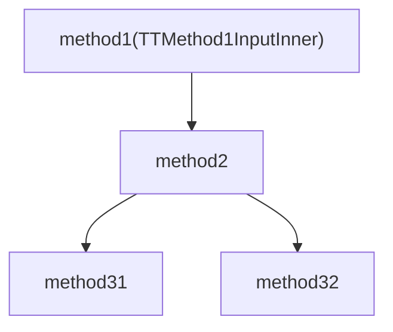
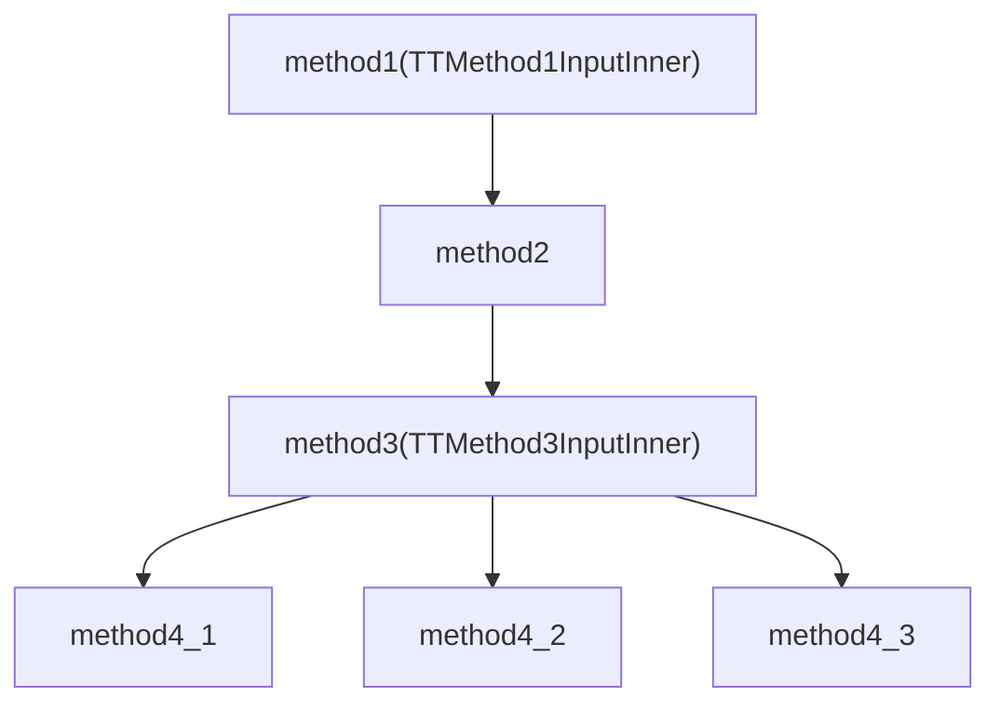
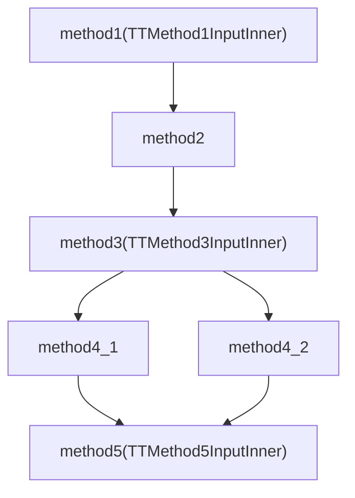
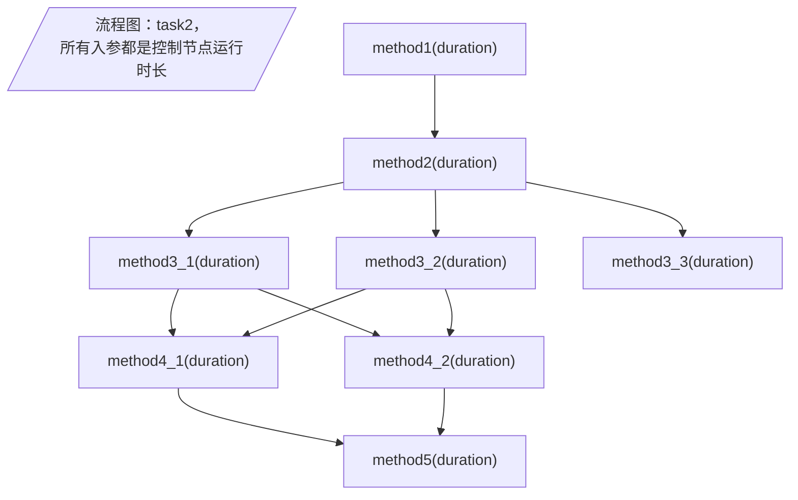

# 任务管理

包括：
1. 任务定义
2. 任务运行
3. stage重试机制

## 测试案例




```json
{
    "code": 0,
    "msg": "msg_b66cc38eda7d",
    "data": {
        "taskName": "aaa",
        "taskVersion": 1,
        "initialEncodedSharedContext": "{\"num\":0,\"name\":\"name_2724f24ea603\",\"ttSharedContextInnerData\":{\"address\":\"address_5490bdf707b2\",\"cache\":\"cache_092ce6e81f1c\"}}",
        "stageEncodedInputs": {
            "method1":"{\"num\":0,\"name\":\"name_9710c942509a\",\"ttMethod1InputInner\":{\"address\":\"address_3ecbf7fb42a0\"}}"
        }
    }
}
```


更新后



```json
{
    "code": 0,
    "msg": "msg_b66cc38eda7d",
    "data": {
        "taskName": "task",
        "taskVersion": 2,
        "initialEncodedSharedContext": "{\"num\":0,\"name\":\"name_2724f24ea603\",\"ttSharedContextInnerData\":{\"address\":\"address_5490bdf707b2\",\"cache\":\"cache_092ce6e81f1c\"}}",
        "stageEncodedInputs": {
            "method1":"{\"num\":0,\"name\":\"name_9710c942509a\",\"ttMethod1InputInner\":{\"address\":\"address_3ecbf7fb42a0\"}}",
            "method3":"{\"age\":0,\"ttMethod3InputInner\":{\"address\":\"address_07c472e79537\"}}"
        }
    }
}
```

再次升级更新后



```json
{
    "code": 0,
    "msg": "msg_b66cc38eda7d",
    "data": {
        "taskName": "task1",
        "taskVersion": 5,
        "initialEncodedSharedContext": "{\"num\":0,\"name\":\"name_2724f24ea603\",\"ttSharedContextInnerData\":{\"address\":\"address_5490bdf707b2\",\"cache\":\"cache_092ce6e81f1c\"}}",
        "stageEncodedInputs": {
            "method1":"{\"num\":0,\"name\":\"name_9710c942509a\",\"ttMethod1InputInner\":{\"address\":\"address_3ecbf7fb42a0\"}}",
            "method3":"{\"age\":0,\"ttMethod3InputInner\":{\"address\":\"address_07c472e79537\"}}",
            "method5":"{\"age\":0,\"ttMethod5InputInner\":{\"name\":\"name_bcd9733b8de0\",\"id\":0}}"
        }
    }
}
```


案例包括：

- [x] scheduler重新选举,,,,,,,,,,,,,,,,,
- [x] 单worker任务定义,,,,,,,,,,,,,,,,,
- [x] 单worker任务创建,,,,,,,,,,,,,,,,,
- [x] 单worker任务更新,,,,,,,,,,,,,,,,,
- [x] 单worker任务更新冲突，版本一致但是细节不一致,,,,,,,,,,,,,,,,,
- [x] 单worker任务不存在，发起执行任务,,,,,,,,,,,,,,,,,
- [x] 单worker任务存在，但是没有可执行这个任务的worker，发起执行任务,,,,,,,,,,,,,,,,,
- [x] 单worker任务运行并成功，包括成功记录日志，并更新任务状态,,,,,,,,,,,,,,,,,
- [x] 单worker任务运行并正常失败，并正常重试，并成功记录状态,,,,,,,,,,,,,,,,,
- [x] 单worker任务运行阶段第一次失败，重试后成功,,,,,,,,,,,,,,,,,
- [x] 单worker任务运行任务整体失败第一次失败，重试后成功,,,,,,,,,,,,,,,,,
- [x] 多worker不同版本任务定义任务创建,,,,,,,,,,,,,,,,,
- [x] 多worker不同版本任务定义任务更新,,,,,,,,,,,,,,,,,
- [x] 多worker不指定版本与指定版本，任务运行并成功，包括成功记录日志，并更新任务状态,,,,,,,,,,,,,,,,,
- [x] 多worker不指定版本与指定版本，任务运行并正常失败，并成功记录状态,,,,,,,,,,,,,,,,,
- [x] 多worker不指定版本与指定版本，任务运行阶段第一次失败，重试后成功,,,,,,,,,,,,,,,,,
- [x] 多worker不指定版本与指定版本，任务运行任务整体失败第一次失败，重试后成功,,,,,,,,,,,,,,,,,
- [ ] 多worker指定版本，stage超时，正常重试，包括重试失败和重试成功
- [ ] 多worker指定版本，task超时，正常重试，包括重试失败和重试成功

# 优雅关闭

任务流转使用



测试案例：

- [ ] m3_1运行2s，m3_2运行10s，其余1s，正常运行完成
- [ ] 没有任务运行，直接执行终止节点操作。预期节点正常终止
- [ ] 运行一个任务，m1 10s 其余1s，执行终止节点，然后m1成功。预期节点正常终止并且任务重新调度到另一个节点。
- [ ] 运行一个任务，m1 10s 其余1s，执行终止节点，然后m1失败。预期节点正常终止并且任务重新调度到另一个节点。
- [ ] 运行一个任务，m2 10s 其余1s，执行终止节点，然后m1失败。预期节点正常终止并且任务重新调度到另一个节点。
- [ ] 运行一个任务，m2 10s 其余1s，执行终止节点，然后m1失败。预期节点正常终止并且任务重新调度到另一个节点。
- [ ] 运行一个任务，m3_1:3s，m3_2:3s，其余:1s，m3_1和m3_2执行过程中执行终止节点，然后m3_1，m3_2成功。预期节点正常终止并且任务重新调度到另一个节点，新任务从m4_1和m4_2开始。
- [ ] 运行一个任务，m3_1:3s，m3_2:3s，其余:1s，m3_1和m3_2执行过程中执行执行终止节点，然后m3_1成功，m3_2失败。预期节点正常终止并且任务重新调度到另一个节点，新任务从m3_2开始。
- [ ] 运行一个任务，m3_1:3s，m3_2:10s，其余:1s，m3_1和m3_2执行过程中执行执行终止节点，然后m3_1，m3_2成功。预期节点在m3_2成功后正常终止并且任务重新调度到另一个节点，新任务从m4_1，m4_2开始。
- [ ] 运行一个任务，m3_1:3s，m3_2:10s，其余:1s，m3_1和m3_2执行过程中执行执行终止节点，然后m3_1成功，m3_2失败。预期节点在m3_2失败后正常终止并且任务重新调度到另一个节点，新任务从m3_2开始。
- [ ] 运行一个任务，m3_1:3s，m3_2:10s，其余:1s，m3_1和m3_2执行过程中执行执行终止节点，然后m3_1成功，m3_2失败并且整体失败。预期节点在m3_2失败后正常终止并且任务不会重新调度到另一个节点。
- [ ] 执行有两个执行中的任务，两个任务同时暂停（需要trick一些代码），预期发送两次safeToTerminate指令并正常暂停
- [ ] 仅执行一个任务，method5执行过程中终止节点，预期该任务正常成功并且不reschedule
- [ ] 初始没有任务运行，然后发送一个任务执行并且在worker处理之前（需要trick一些代码），发送终止节点操作。预期：节点正常启动执行任务并且在起始节点运行完成后重调度

