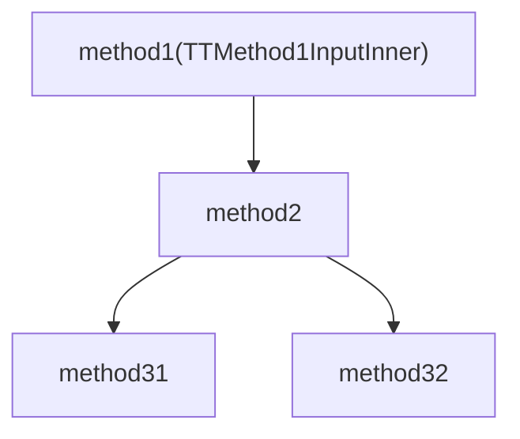
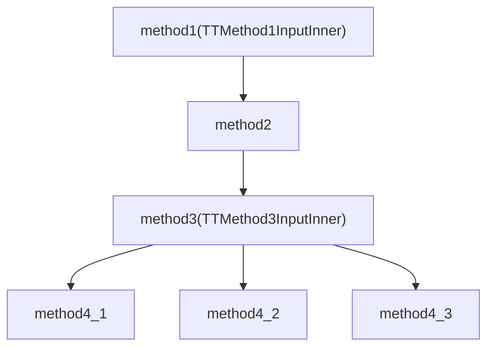

# 任务管理

包括：
1. 任务定义
2. 任务运行
3. stage重试机制

## 测试案例1




```json
{
    "code": 0,
    "msg": "msg_b66cc38eda7d",
    "data": {
        "taskName": "aaa",
        "taskVersion": 1,
        "initialEncodedSharedContext": "{\"num\":0,\"name\":\"name_2724f24ea603\",\"ttSharedContextInnerData\":{\"address\":\"address_5490bdf707b2\",\"cache\":\"cache_092ce6e81f1c\"}}",
        "stageEncodedInputs": {
            "method1":"{\"num\":0,\"name\":\"name_9710c942509a\",\"ttMethod1InputInner\":{\"address\":\"address_3ecbf7fb42a0\"}}"
        }
    }
}
```


更新后



```json
{
    "code": 0,
    "msg": "msg_b66cc38eda7d",
    "data": {
        "taskName": "task",
        "taskVersion": 2,
        "initialEncodedSharedContext": "{\"num\":0,\"name\":\"name_2724f24ea603\",\"ttSharedContextInnerData\":{\"address\":\"address_5490bdf707b2\",\"cache\":\"cache_092ce6e81f1c\"}}",
        "stageEncodedInputs": {
            "method1":"{\"num\":0,\"name\":\"name_9710c942509a\",\"ttMethod1InputInner\":{\"address\":\"address_3ecbf7fb42a0\"}}",
            "method3":"{\"age\":0,\"ttMethod3InputInner\":{\"address\":\"address_07c472e79537\"}}"
        }
    }
}
```

