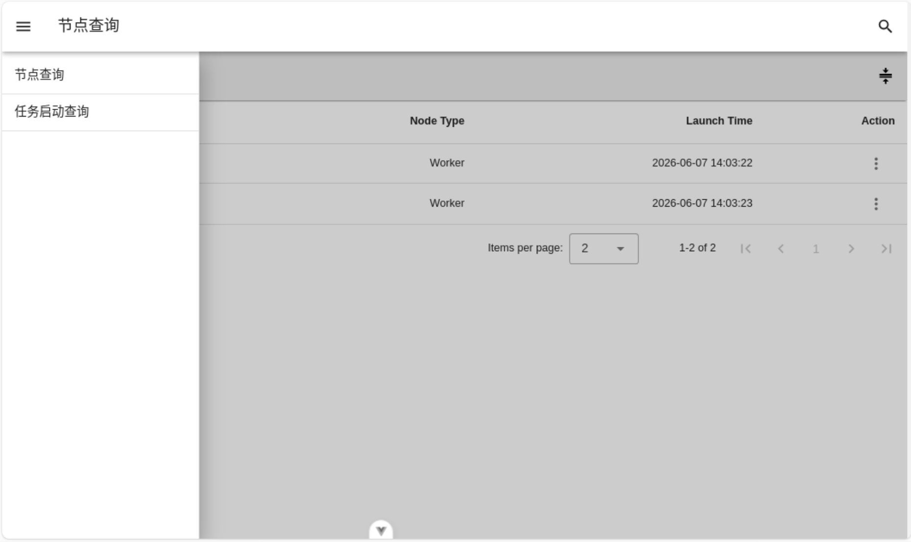
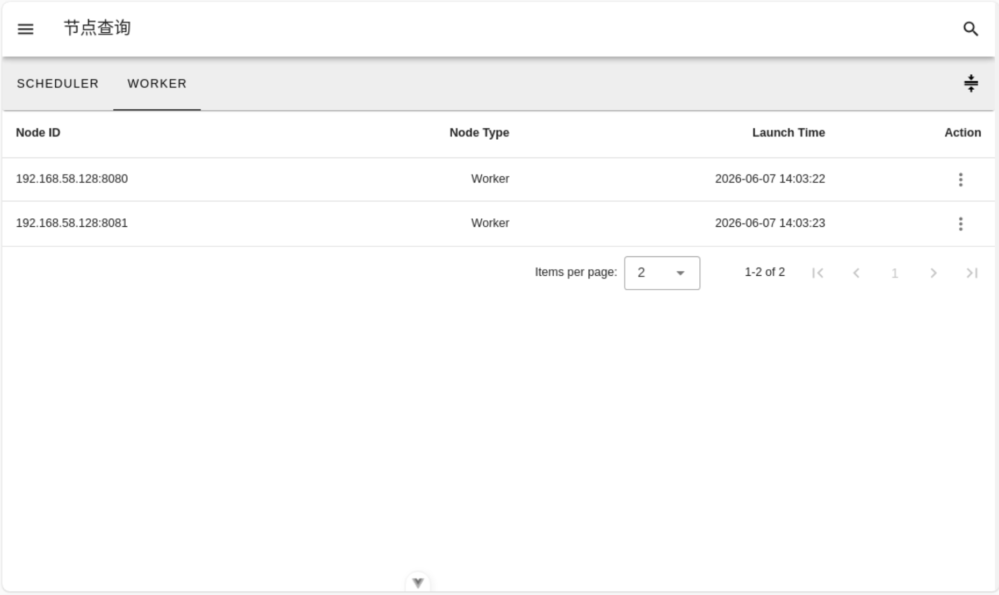
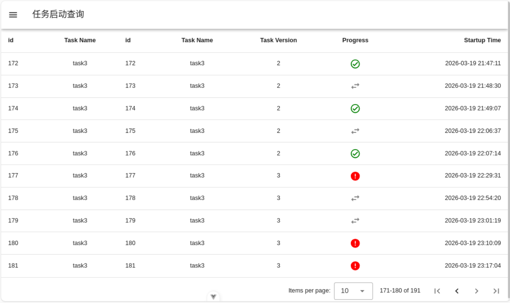
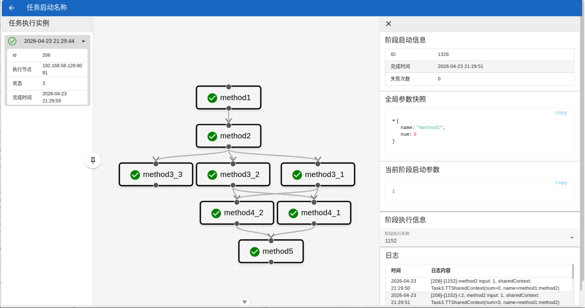
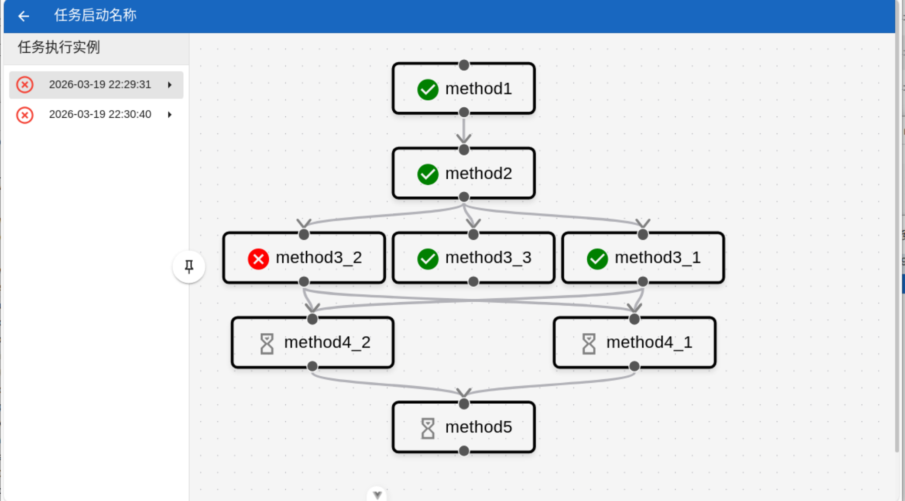

# 梗概
这是一个任务调度工具，在前司接触过两个有向无环图（DAG）的任务调度工具，一个是大数据计算任务调度工具；另一个是支持任务调度的Java业务逻辑运行框架，但问题是只支持链式任务、入参弱类型、节点无法平滑下线。对此非常感兴趣，所以也想自己也造个类似轮子。

项目分为：
1. free-flow：后端应用项目
2. free-flow-web：前端项目

## free-flow

分布式DAG任务调度框架，支持树状的DAG的任务编排、执行、失败重试、节点优雅下线与任务迁移。节点分为两类，节点的管理依赖Zookeeper：
1. scheduler：是一个独立部署的服务，负责管控Worker、调度任务，其中Leader节点还额外负责节点上下线后的写库。
2. Worker：是一个基于Spring-SPI实现的Starter，依赖了这个starter之后，自动称为Worker节点，只需要定义Task定义即可。

## free-flow-web
一个简单的vue+vuetify+vue-flow实现的任务定义列表查询、任务执行列表和具体的任务执行进度查看的可视化功能。示意图如下：

菜单：

节点查询

任务列表与执行信息查询

支持查看任务执行详情

如果任务执行过程发生失败，会按照任务执行实例进行划分

