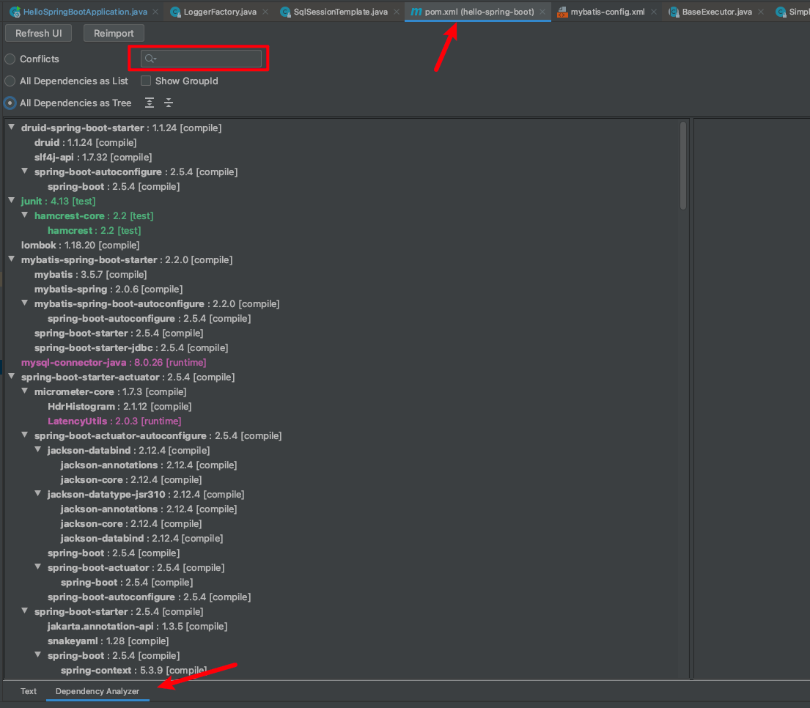
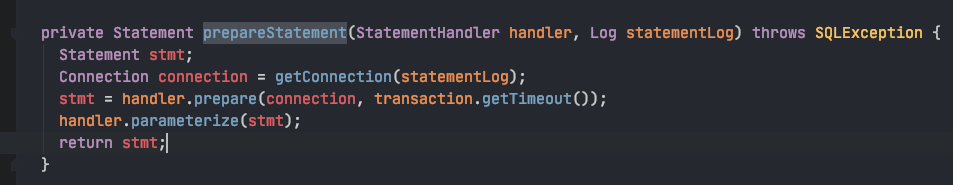
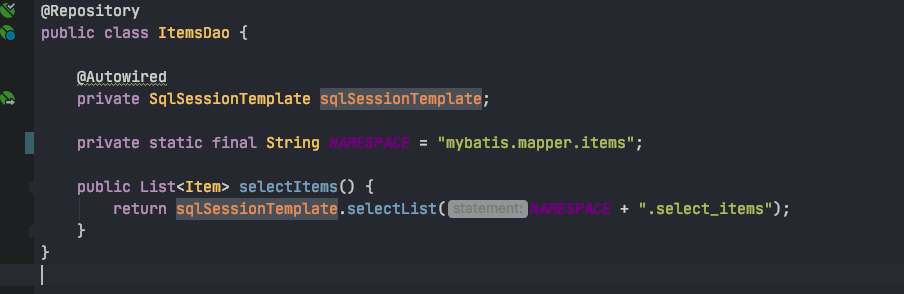
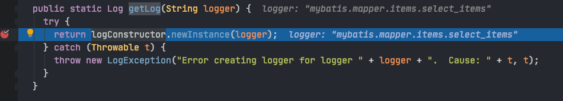

# springboot + log4j2 + mybatis(sqlSessionTemplate风格) 配置


## 需求

使用log4j2对springboot做日志，并且希望将mybatis使用sqlSessionTemplate风格的sql日志打印出来。


## 问题

在mybatis-config.xml配置了使用log4j2进行日志实现

```xml
<?xml version="1.0" encoding="UTF-8" ?>
<!DOCTYPE configuration
        PUBLIC "-//mybatis.org//DTD Config 3.0//EN"
        "http://mybatis.org/dtd/mybatis-3-config.dtd">
<configuration>

    <settings>
        <setting name="useColumnLabel" value="true"/>
        <setting name="mapUnderscoreToCamelCase" value="true"/>
        <setting name="logImpl" value="LOG4j2"/>
    </settings>

    <typeAliases>
        <package name="com.example.springboot.hellospringboot.domain"/>
    </typeAliases>

</configuration>
```
也在log4j的xml配置里进行了配置，但是log4j似乎没有被使用

```xml
<?xml version="1.0" encoding="UTF-8"?>
<!--status用来指定log4j本身的打印日志的级别.
monitorinterval为log4j 2.x新特点自动重载配置。指定自动重新配置的监测间隔时间，单位是s,最小是5s。-->
<configuration status="warn">
    <!--先定义所有的appender -->
    <appenders>
        <!--这个输出控制台的配置 -->
        <Console name="DETAIL" target="SYSTEM_OUT">
            <!--日志级别以及优先级排序: OFF > FATAL > ERROR > WARN > INFO > DEBUG > TRACE > ALL -->
            <!--             控制台只输出level及以上级别的信息（onMatch），其他的直接拒绝（onMismatch） -->
            <ThresholdFilter level="info" onMatch="ACCEPT" onMismatch="DENY"/>
            <!--             这个都知道是输出日志的格式 -->
            <PatternLayout
                    pattern="%d{yyyy-MM-dd HH:mm:ss.SSS} %highlight{%-10level}{FATAL=red, ERROR=red, WARN=yellow, INFO=cyan, DEBUG=cyan,TRACE=blue} %style{%-20pid}{blue} --- [%-10thread] %-10class{1} %.10location %.10method : %msg%xThrowable%n"/>
        </Console>

        <Console name="CONSOLE" target="SYSTEM_OUT">
            <ThresholdFilter level="info" onMatch="ACCEPT" onMismatch="DENY"/>
            <PatternLayout
                    pattern="%d{yyyy-MM-dd HH:mm:ss.SSS} [%highlight{%-5level}{FATAL=red, ERROR=red, WARN=yellow, INFO=cyan, DEBUG=cyan,TRACE=blue}] %style{%-5pid}{blue} --- [%.10thread] %-10class{1} : %msg%xThrowable%n"/>
        </Console>

        <Console name="SQL_CONSOLE" target="SYSTEM_OUT">
            <PatternLayout
                    pattern="%d{yyyy-MM-dd HH:mm:ss.SSS} [%highlight{%-5level}{FATAL=red, ERROR=red, WARN=yellow, INFO=cyan, DEBUG=cyan,TRACE=blue}] %style{%-5pid}{blue} --- [%.10thread] %-10class{1} : %msg%xThrowable%n"/>
        </Console>


        <!--文件会打印出所有信息，这个log每次运行程序会自动清空，由append属性决定，这个也挺有用的，适合临时测试用 -->
        <!--append为TRUE表示消息增加到指定文件中，false表示消息覆盖指定的文件内容，默认值是true -->
        <File name="LOG_FILE" fileName="logs/root.log" append="false">
            <ThresholdFilter level="info" onMatch="ACCEPT" onMismatch="DENY"/>
            <PatternLayout
                    pattern="%d{yyyy-MM-dd HH:mm:ss.SSS} [%-5level] %-5pid --- [%.10thread] %-10class{1} : %msg%xEx%n"/>
        </File>

        <!--添加过滤器ThresholdFilter,可以有选择的输出某个级别以上的类别  onMatch="ACCEPT" onMismatch="DENY"意思是匹配就接受,否则直接拒绝  -->
        <File name="ERROR_FILE" fileName="logs/error.log" append="false">
            <ThresholdFilter level="error" onMatch="ACCEPT" onMismatch="DENY"/>
            <PatternLayout
                    pattern="%d{yyyy-MM-dd HH:mm:ss.SSS} [%-5level] %-5pid --- [%.10thread] %-10class{1} : %msg%xEx%n"/>
        </File>

        <!--这个会打印出所有的信息，每次大小超过size，则这size大小的日志会自动存入按年份-月份建立的文件夹下面并进行压缩，作为存档 -->
        <RollingFile name="ROLLING_FILE" fileName="logs/rolling.log"  append="false"
                     filePattern="logs/$${date:yyyy-MM}/web-%d{MM-dd-yyyy}-%i.log.gz">
            <ThresholdFilter level="info" onMatch="ACCEPT" onMismatch="DENY"/>
            <PatternLayout
                    pattern="%d{yyyy-MM-dd HH:mm:ss.SSS} [%-5level] %-5pid --- [%.10thread] %-10class{1} : %msg%xThrowable%n"/>
            <SizeBasedTriggeringPolicy size="10MB"/>
        </RollingFile>
    </appenders>


    <!--然后定义logger，只有定义了logger并引入的appender，appender才会生效 -->
    <loggers>

        <!--        下面控制的是root的logger-->
        <root level="trace">

            <AppenderRef ref="CONSOLE"/>
            <AppenderRef ref="ROLLING_FILE"/>
            <AppenderRef ref="LOG_FILE"/>
            <AppenderRef ref="ERROR_FILE"/>
        </root>


    </loggers>
</configuration>
```

## 解决

### 先让log4j接管spring日志系统

背景：spring-boot的日志系统默认是logback，这个日志系统被藏在spring-boot-starter-logging这个项目之中，由于我引入了很多个starter，并不知道这个spring-boot-starter-logging是被谁引入的，因此可以借助mvn dependency:tree打印依赖树，或者直接借助idea的Denpendency Analyzer，打开pom，然后点击Dependency Analyzer，然后搜索



我的是由于spring-boot-starter-actuator而引入的logging项目，那么排除掉就好了，然后将log4j2的依赖搞进来

```xml
<dependency>
			<groupId>org.springframework.boot</groupId>
			<artifactId>spring-boot-starter-actuator</artifactId>
			<exclusions>
				<exclusion>
					<groupId>org.springframework.boot</groupId>
					<artifactId>spring-boot-starter-logging</artifactId>
				</exclusion>
			</exclusions>
		</dependency>

<dependency>
			<groupId>org.springframework.boot</groupId>
			<artifactId>spring-boot-starter-log4j2</artifactId>
		</dependency>

```

目前为止 spring的日志系统被log4j2接管了。


### 如何让mybatis使用log4j2来打印sql日志，同时还不要打印过多其他的trace日志呢

首先，需要在mybatis的配置里新增`<setting name="logImpl" value="LOG4j2"/>`

其次，需要注意的是mybatis的sql日志有两个级别，分别是`trace`与`debug`，前者是具体的sql返回结果，后者是sql语句以及返回行数，这两个级别都低于`info`

在上面的log4j配置之中，在loggers标签里有一个叫做root的标签，这个可以理解为用于打印日志的logger，此时就是系统默认的logger，当系统调用了logger.xxx（例如log.trace或者log.info等等）想打印日志的时候，这些日志的内容都会流入到root里，然后每个Appender对这些日志进行一些操作，例如过滤、输出、调整输出格式和目标等等。最终呈现在文件或者控制台里。

那既然想打印mybatis的sql，好办，新增一个可以打印trace日志的Appender就好了

```xml
<?xml version="1.0" encoding="UTF-8"?>
<!--status用来指定log4j本身的打印日志的级别.
monitorinterval为log4j 2.x新特点自动重载配置。指定自动重新配置的监测间隔时间，单位是s,最小是5s。-->
<configuration status="warn">
    <!--先定义所有的appender -->
    <appenders>
        <!--这个输出控制台的配置 -->
        <Console name="DETAIL" target="SYSTEM_OUT">
            <!--日志级别以及优先级排序: OFF > FATAL > ERROR > WARN > INFO > DEBUG > TRACE > ALL -->
            <!--             控制台只输出level及以上级别的信息（onMatch），其他的直接拒绝（onMismatch） -->
            <ThresholdFilter level="info" onMatch="ACCEPT" onMismatch="DENY"/>
            <!--             这个都知道是输出日志的格式 -->
            <PatternLayout
                    pattern="%d{yyyy-MM-dd HH:mm:ss.SSS} %highlight{%-10level}{FATAL=red, ERROR=red, WARN=yellow, INFO=cyan, DEBUG=cyan,TRACE=blue} %style{%-20pid}{blue} --- [%-10thread] %-10class{1} %.10location %.10method : %msg%xThrowable%n"/>
        </Console>

        <Console name="CONSOLE" target="SYSTEM_OUT">
            <ThresholdFilter level="info" onMatch="ACCEPT" onMismatch="DENY"/>
            <PatternLayout
                    pattern="%d{yyyy-MM-dd HH:mm:ss.SSS} [%highlight{%-5level}{FATAL=red, ERROR=red, WARN=yellow, INFO=cyan, DEBUG=cyan,TRACE=blue}] %style{%-5pid}{blue} --- [%.10thread] %-10class{1} : %msg%xThrowable%n"/>
        </Console>

        <Console name="SQL_CONSOLE" target="SYSTEM_OUT">
            <ThresholdFilter level="trace" onMatch="ACCEPT" onMismatch="DENY"/>
            <PatternLayout
                    pattern="%d{yyyy-MM-dd HH:mm:ss.SSS} [%highlight{%-5level}{FATAL=red, ERROR=red, WARN=yellow, INFO=cyan, DEBUG=cyan,TRACE=blue}] %style{%-5pid}{blue} --- [%.10thread] %-10class{1} : %msg%xThrowable%n"/>
        </Console>


        <!--文件会打印出所有信息，这个log每次运行程序会自动清空，由append属性决定，这个也挺有用的，适合临时测试用 -->
        <!--append为TRUE表示消息增加到指定文件中，false表示消息覆盖指定的文件内容，默认值是true -->
        <File name="LOG_FILE" fileName="logs/root.log" append="false">
            <ThresholdFilter level="info" onMatch="ACCEPT" onMismatch="DENY"/>
            <PatternLayout
                    pattern="%d{yyyy-MM-dd HH:mm:ss.SSS} [%-5level] %-5pid --- [%.10thread] %-10class{1} : %msg%xEx%n"/>
        </File>

        <!--添加过滤器ThresholdFilter,可以有选择的输出某个级别以上的类别  onMatch="ACCEPT" onMismatch="DENY"意思是匹配就接受,否则直接拒绝  -->
        <File name="ERROR_FILE" fileName="logs/error.log" append="false">
            <ThresholdFilter level="error" onMatch="ACCEPT" onMismatch="DENY"/>
            <PatternLayout
                    pattern="%d{yyyy-MM-dd HH:mm:ss.SSS} [%-5level] %-5pid --- [%.10thread] %-10class{1} : %msg%xEx%n"/>
        </File>

        <!--这个会打印出所有的信息，每次大小超过size，则这size大小的日志会自动存入按年份-月份建立的文件夹下面并进行压缩，作为存档 -->
        <RollingFile name="ROLLING_FILE" fileName="logs/rolling.log"  append="false"
                     filePattern="logs/$${date:yyyy-MM}/web-%d{MM-dd-yyyy}-%i.log.gz">
            <ThresholdFilter level="info" onMatch="ACCEPT" onMismatch="DENY"/>
            <PatternLayout
                    pattern="%d{yyyy-MM-dd HH:mm:ss.SSS} [%-5level] %-5pid --- [%.10thread] %-10class{1} : %msg%xThrowable%n"/>
            <SizeBasedTriggeringPolicy size="10MB"/>
        </RollingFile>
    </appenders>


    <!--然后定义logger，只有定义了logger并引入的appender，appender才会生效 -->
    <loggers>

        <!--        下面控制的是root的logger-->
        <root level="trace">
            <AppenderRef ref="SQL_CONSOLE"/>

            <AppenderRef ref="CONSOLE"/>
            <AppenderRef ref="SQL_CONSOLE"/>
            <AppenderRef ref="ROLLING_FILE"/>
            <AppenderRef ref="LOG_FILE"/>
            <AppenderRef ref="ERROR_FILE"/>
        </root>
    </loggers>
</configuration>
```


结果发现sql确实是打印出来了，但是spring框架的一堆trace日志和debug日志也都跟着出来了，海海的一大片，显然我们指向要mybatis的sql的日志，其他的一律不想要；log4j2提供了这个功能，就是在loggers里添加一个独立的logger

```xml
<?xml version="1.0" encoding="UTF-8"?>
<!--status用来指定log4j本身的打印日志的级别.
monitorinterval为log4j 2.x新特点自动重载配置。指定自动重新配置的监测间隔时间，单位是s,最小是5s。-->
<configuration status="warn">
    <!--先定义所有的appender -->
    <appenders>
        <!--这个输出控制台的配置 -->
        <Console name="DETAIL" target="SYSTEM_OUT">
            <!--日志级别以及优先级排序: OFF > FATAL > ERROR > WARN > INFO > DEBUG > TRACE > ALL -->
            <!--             控制台只输出level及以上级别的信息（onMatch），其他的直接拒绝（onMismatch） -->
            <ThresholdFilter level="info" onMatch="ACCEPT" onMismatch="DENY"/>
            <!--             这个都知道是输出日志的格式 -->
            <PatternLayout
                    pattern="%d{yyyy-MM-dd HH:mm:ss.SSS} %highlight{%-10level}{FATAL=red, ERROR=red, WARN=yellow, INFO=cyan, DEBUG=cyan,TRACE=blue} %style{%-20pid}{blue} --- [%-10thread] %-10class{1} %.10location %.10method : %msg%xThrowable%n"/>
        </Console>

        <Console name="CONSOLE" target="SYSTEM_OUT">
            <ThresholdFilter level="info" onMatch="ACCEPT" onMismatch="DENY"/>
            <PatternLayout
                    pattern="%d{yyyy-MM-dd HH:mm:ss.SSS} [%highlight{%-5level}{FATAL=red, ERROR=red, WARN=yellow, INFO=cyan, DEBUG=cyan,TRACE=blue}] %style{%-5pid}{blue} --- [%.10thread] %-10class{1} : %msg%xThrowable%n"/>
        </Console>

        <Console name="SQL_CONSOLE" target="SYSTEM_OUT">
            <ThresholdFilter level="trace" onMatch="ACCEPT" onMismatch="DENY"/>
            <PatternLayout
                    pattern="%d{yyyy-MM-dd HH:mm:ss.SSS} [%highlight{%-5level}{FATAL=red, ERROR=red, WARN=yellow, INFO=cyan, DEBUG=cyan,TRACE=blue}] %style{%-5pid}{blue} --- [%.10thread] %-10class{1} : %msg%xThrowable%n"/>
        </Console>


        <!--文件会打印出所有信息，这个log每次运行程序会自动清空，由append属性决定，这个也挺有用的，适合临时测试用 -->
        <!--append为TRUE表示消息增加到指定文件中，false表示消息覆盖指定的文件内容，默认值是true -->
        <File name="LOG_FILE" fileName="logs/root.log" append="false">
            <ThresholdFilter level="info" onMatch="ACCEPT" onMismatch="DENY"/>
            <PatternLayout
                    pattern="%d{yyyy-MM-dd HH:mm:ss.SSS} [%-5level] %-5pid --- [%.10thread] %-10class{1} : %msg%xEx%n"/>
        </File>

        <!--添加过滤器ThresholdFilter,可以有选择的输出某个级别以上的类别  onMatch="ACCEPT" onMismatch="DENY"意思是匹配就接受,否则直接拒绝  -->
        <File name="ERROR_FILE" fileName="logs/error.log" append="false">
            <ThresholdFilter level="error" onMatch="ACCEPT" onMismatch="DENY"/>
            <PatternLayout
                    pattern="%d{yyyy-MM-dd HH:mm:ss.SSS} [%-5level] %-5pid --- [%.10thread] %-10class{1} : %msg%xEx%n"/>
        </File>

        <!--这个会打印出所有的信息，每次大小超过size，则这size大小的日志会自动存入按年份-月份建立的文件夹下面并进行压缩，作为存档 -->
        <RollingFile name="ROLLING_FILE" fileName="logs/rolling.log"  append="false"
                     filePattern="logs/$${date:yyyy-MM}/web-%d{MM-dd-yyyy}-%i.log.gz">
            <ThresholdFilter level="info" onMatch="ACCEPT" onMismatch="DENY"/>
            <PatternLayout
                    pattern="%d{yyyy-MM-dd HH:mm:ss.SSS} [%-5level] %-5pid --- [%.10thread] %-10class{1} : %msg%xThrowable%n"/>
            <SizeBasedTriggeringPolicy size="10MB"/>
        </RollingFile>
    </appenders>


    <!--然后定义logger，只有定义了logger并引入的appender，appender才会生效 -->
    <loggers>

        <!--        下面控制的是root的logger-->
        <root level="trace">
            <AppenderRef ref="CONSOLE"/>
            <AppenderRef ref="ROLLING_FILE"/>
            <AppenderRef ref="LOG_FILE"/>
            <AppenderRef ref="ERROR_FILE"/>
        </root>


        <Logger name="mybatis.mapper" level="trace">
            <AppenderRef ref="SQL_CONSOLE"/>
        </Logger>


    </loggers>
</configuration>
```

这个独立的logger的名称叫做items，这是因为我的mappers.xml的namespace均以mybatis.mapper开头

```xml
<?xml version="1.0" encoding="UTF-8" ?>
<!DOCTYPE mapper
        PUBLIC "-//mybatis.org//DTD Mapper 3.0//EN"
        "http://mybatis.org/dtd/mybatis-3-mapper.dtd">
<mapper namespace="mybatis.mapper.items">
    <select id="select_items" resultType="Item">
        select * from items
    </select>
</mapper>
```


可以通过对org.apache.ibatis.executor.SimpleExecutor#prepareStatement这个方法打断点




可以看到每个statementLog的name都是sqlSessionTemplate的statement参数，如




mybatis的所有日志对象都是通过org.apache.ibatis.logging.LogFactory#getLog(java.lang.String)这个方法创建的

通过反射来创建logger对象



本案例中，最终会使用log4j的LogManager来创建log（与简单使用log4j的方式相同）

所以呢我们自定义的logger的名称，就得是mapper.xml的namespace的前缀，才能将日志数据送入相应的目标Logger里（log4j实现的），从而对结果进行打印。


### 其他

当然如果使用的是Mapper class做dao，那么Logger的name直接就写成dao类的包名就行了。

