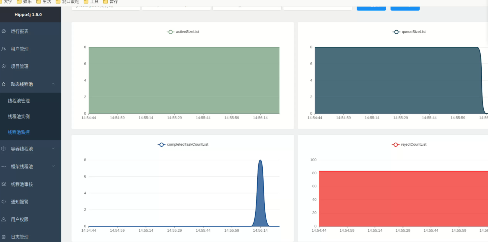

# 配置server
hippo与springboot3不兼容，不知道为啥，不如用Dynamic TP
```shell
docker pull hippo4j/hippo4j-server:1.5.0

docker run -it --rm -p 6691:6691 --name hippo4j-server hippo4j/hippo4j-server:1.5.0


```

然后在localhost:6691里进行配置，分别需要：
1. 配置项目管理：新增一个项目
2. 线程池管理：配置本项目会用的线程池，主要是线程池名需要与本地代码中config的配置匹配。

随后启动项目

另外，只有运行中的线程池，才会体现在线程池监控里。，本案例中，提交了100个任务，每个任务耗时大概一分半，在线程池监控里可以看到活跃的任务、排队的任务和完成的任务

