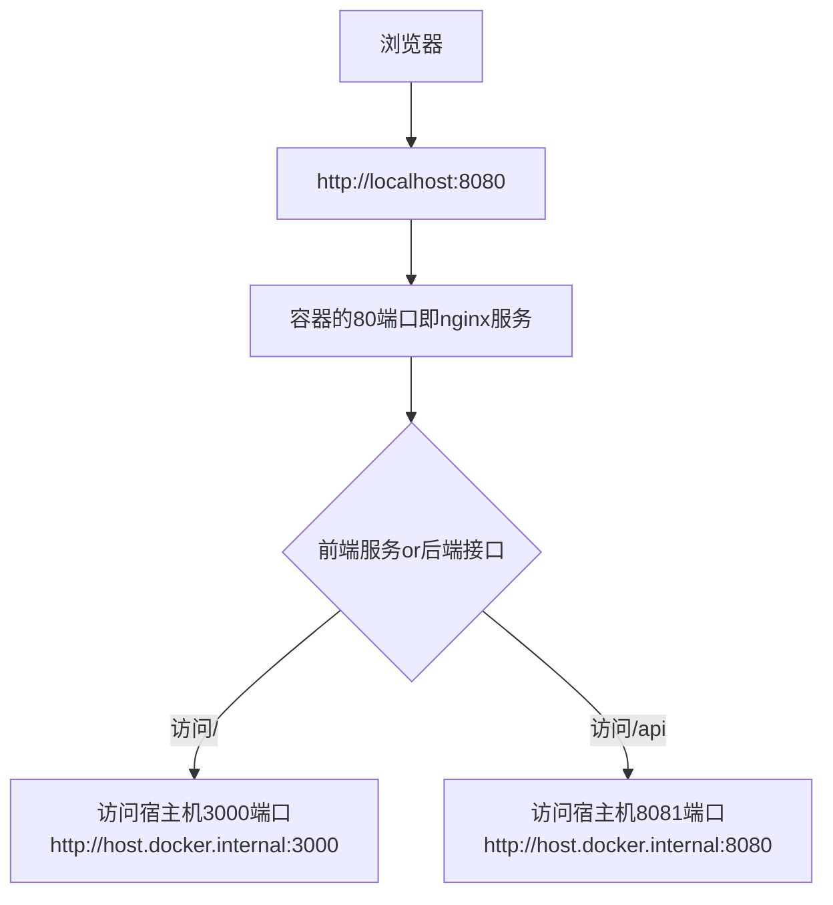

配合security1的前端工程

```shell
npx create-react-app security1-frontend --template typescript


npm install axios
npm install react-cookie --save
```


# 解决跨域问题
教程来自[Spring Security 保姆级教程！40000字！](https://blog.csdn.net/qq_17231297/article/details/129173532)，教程里使用的是spring2.
5，这里换成3.4

烦死了就测点案例，一堆跨域问题，因此尝试使用反向代理解决，通过nginx来进行反向代理，让浏览器以为接口和前端静态页面都是来自于同一个服务器。

首先搭建一个nginx，再把这个服务启起来，并且还得能让nginx容器能够访问主机，参照[【docker知识】从容器中如何访问到宿主机](https://blog.csdn.net/gongdiwudu/article/details/128888497)
```shell
docker pull nginx:1.27.3
docker run -it --rm --add-host host.docker.internal:host-gateway -p 8080:80 nginx:1.27.3 bash

# 容器里
curl host.docker.internal:8081/index.html
# 能看到页面就行


docker run -it --rm -v ./nginx.conf:/etc/nginx/nginx.conf -p 8080:80 nginx:1.27.3 bash

```


使用nginx来解决跨域问题，跨域问题是比如说react工程在3000端口，而后端端口在8080端口，那么浏览器发现他访问的是3000端口，但是发起了8080端口的请求，那么就会很麻烦，因为这时候如果是复杂请求，那么浏览器会先发一个option请求，通过之后才会发送正式的我们代码里的请求。

那么为了规避这个问题，我选择使用nginx同时来对前端服务和后端服务进行反向代理，浏览器直接访问nginx，通过负载均衡的方法，让浏览器认为前端服务和后端服务都是同一台服务。

```shell
docker pull nginx:1.27.3

docker run -it --rm --add-host host.docker.internal:host-gateway -v ./default.conf:/etc/nginx/conf.d/default.conf -p 8080:80 nginx:1.27.3
```

关键的配置如下
```
 # 给前端服务做代理，由于目前我还不太会用react的router，所有页面都在根目录，所以在主机里直接访问http://localhost:8080/即可，记得要带个小尾巴/
    location / {
        proxy_pass http://host.docker.internal:3000;
        # root   /usr/share/nginx/html;
        # index  index.html index.htm;
    }

    # 给服务端接口做反向代理
    location /api {
        proxy_pass http://host.docker.internal:8081;
        # root   /usr/share/nginx/html;
        # index  index.html index.htm;
    }
```

整个的流程大概就是下面这样（用typora打开）：


可以看到对于浏览器来说，他访问的一直是`http://localhost:8080`