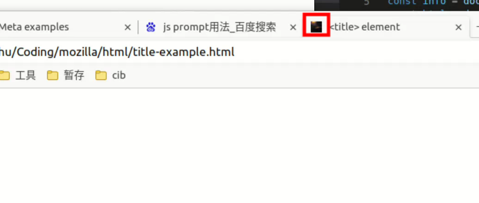
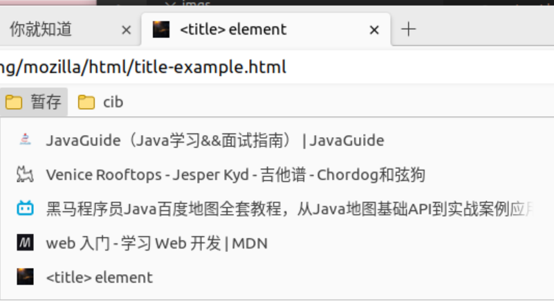
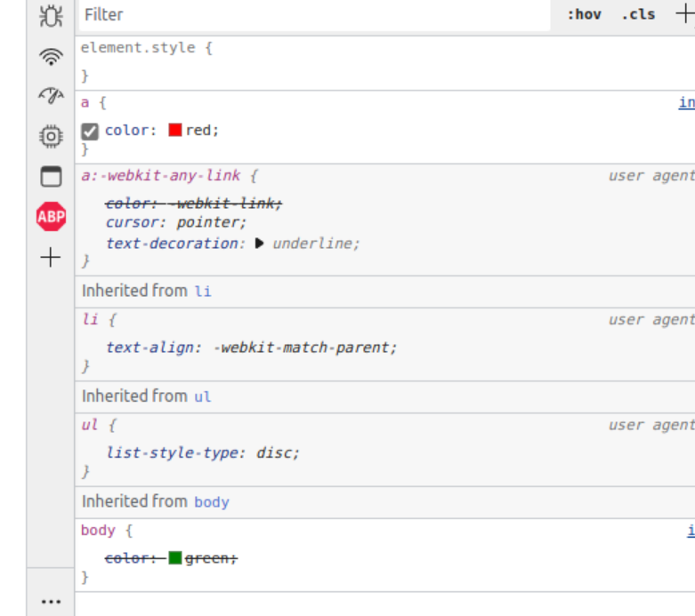
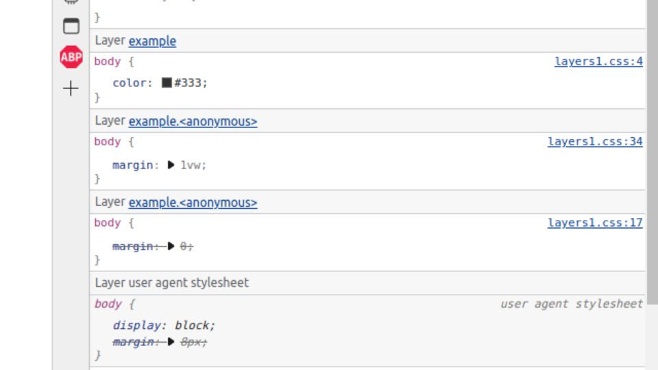
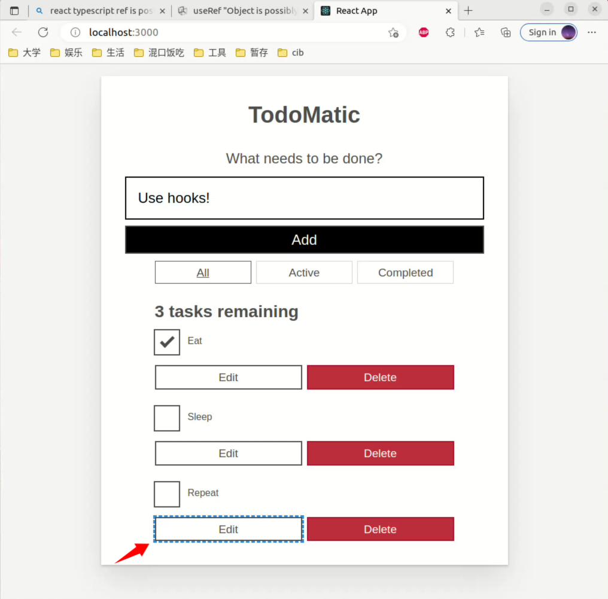

# 构建react工程


https://blog.csdn.net/qq_24671941/article/details/105242045

```
1.查看npm的镜像源
npm config get registry
// 默认是：https://registry.npmjs.org/

2.修改成淘宝的镜像源
npm config set registry https://registry.npmmirror.com

3.create-react-app创建项目
npx create-react-app myapp


npx create-react-app a-little-sparrow-web --template typescript
```

或者直接改一下(不推荐)

```js
$ npm install -g create-react-app
$ create-react-app myapp --template typescript
```

# Getting_started_with_the_web

https://developer.mozilla.org/zh-CN/docs/Learn/Getting_started_with_the_web

mdn代码https://github.com/mdn/learning-area直接拷贝就行


## Installing_basic_software

> [安装本地 Web 服务器](https://developer.mozilla.org/zh-CN/docs/Learn/Getting_started_with_the_web/Installing_basic_software#安装本地_web_服务器) 
>
> 
>
> 有些例子需要通过 Web 服务器才能成功运行。你可以在这找到该怎么做[如何设置本地测试服务器？](https://developer.mozilla.org/zh-CN/docs/Learn/Common_questions/Tools_and_setup/set_up_a_local_testing_server)


该文档中的一个Web服务器的例子就是一个Express（JS）或者Django服务器（Python）所谓本地Web服务器其实就是一个后端服务器。例如后端提供接口的服务。完全可以用Spring-boot-web-starter替代。


## 处理文件

> 1. 浏览器、网络服务器和编程语言对空格的处理并不一致。例如，如果你在文件名中使用空格，一些系统可能将其视为两个文件名。一些服务器会用“%20”（URL 中空格的字符代码）替换文件名中的区域，导致所有链接被破坏。最好用连字符而不是下划线来分隔单词。对比 `my-file.html` 与 `my_file.html`。


# HTML-构建Web

## HTML简介


### “头”里有什么-HTML元信息


```html
 <link rel="icon" href="../imgs/gligor-andrei-lazar-rb5kE1N1mkg-unsplash.jpg" type="image/x-icon"/>
```

用来标识代表网页的图片，可能在标签页，也可能在收藏夹里显示





### 

### 文档与网站架构

#### HTML布局元素细节

`<article>`/`<section>`本身也是各种块级元素，只不过从html的角度上来看，这些元素是具备结构性语义的


## 多媒体与嵌入


### 响应式图片

[响应式图片srcset未生效](https://blog.csdn.net/z1844306480/article/details/114154889)

```html


```

不同浏览器里策略不同，上述写法里，edge浏览器就会默认使用已缓存的图片以减小流量占用，而firefox浏览器就会按照上述规则使用对应的图片，解决办法是使用另一种picture+source的方式做图片显示

下述写法里，是根据设配显示像素与css像素的比值来选择要显示的图片

```html

```

在html文档里，关于source的例子如下所示，当大于800时，显示wid，大于600时显示medium，如果不满足则显示narrow

```html
<picture>
  <source srcset="mdn-logo-wide.png" media="(min-width: 800px)" />
  <source srcset="mdn-logo-medium.png" media="(min-width: 600px)" />
  
</picture>
```


## html表格

### html表格基础

`colspan`和`rowspan`要计算一下跨行和跨列的多少，比如

```html
<tr>
        <th rowspan="2">马</th>
        <td>母马</td>
      </tr>
      <tr>
        <td>种马</td>
      </tr>
```

那么`马`就会占据下一行的第一列

### HTML 表格高级特性和无障碍

#### id/headers

行头或者列头用`id`标识，而每个`td`归属于哪个行和列用`headers`来标识。

# CSS-设计Web

## CSS第一步


### 让我们开启CSS的学习之旅；


```css
body h1 + p .special {
  color: yellow;
  background-color: black;
  padding: 5px;
}
```

在`body`内部的紧跟着一个`h1`的`p`标签，的内部的类为`.special`标签


### 如何构建CSS

#### calc函数

```html
<div class="outer"><div class="box">The inner box is 90% - 30px.</div></div>
```


```css
.outer {
  border: 5px solid black;
}
.box {
padding: 10px;
width: calc(70% - 30px);
background-color: rebeccapurple;
color: white;
}
```

box的宽度一直是其外层盒子的百分之70-30px，可以通过调整浏览器大小来观测效果，可以看到一直是外层的70%左右，而如果写为200px，那么就是一个定死的大小，不会改变。

### CSS如何运行

> 当你为一个元素指定多个 CSS 样式的时候，浏览器会加载样式表中的最后的 CSS 代码进行渲染

比如

```css
.box {
  width: 500px;
  width: calc(100% - 50px);
}
```

## CSS基础

一个属性可以由有多个取值，用空格分开，例如一个标签有多个类`<a class="a b">`

### 选择器

选择器的语法就是tmd硬背，没有什么规律


### 伪类伪元素选择器


下列选择器的含义为article标签里的(p标签且作为其父标签的第一个子标签)的内容，所以`p:first-child`是用来修饰`p`的

```css
article p:first-child {
    font-size: 120%;
    font-weight: bold;
}   
```

### 层叠与集成


```css
body {
    color: green;
}
          
.my-class-1 a {
    color: inherit;
}
          
.my-class-2 a {
    color: initial;
}
          
.my-class-3 a {
    color: unset;
}
```

```html
<ul>
    <li>Default <a href="#">link</a> color</li>
    <li class="my-class-1">Inherit the <a href="#">link</a> color</li>
    <li class="my-class-2">Reset the <a href="#">link</a> color</li>
    <li class="my-class-3">Unset the <a href="#">link</a> color</li>
</ul>
```

问题3：如果你为 `<a>` 元素定义新的颜色（例如：`a { color: red; }`），哪些链接会改变颜色？

答案：只有第一个link会变色，剩余的link要么继承要么初始化，而第一个link里虽然也在link里，但是标签a本身的样式优先级高于继承；如下图



问题4：阅读下一节有关重置所有属性的内容后，回到这里，并将 `color` 属性改为 `all` 属性。注意第二个链接是怎么出现在新的一行中，还带有一个无序列表的符号的。你认为继承了哪些属性。

`a`从body哪里将一切东西继承下来了，比如`display:block`，因此`a`变成了一个块级元素，他要自己占一行，可以通过修改`display:inline`来改回来。

#### 优先级

`button:not(#mainBtn, .cta)`为101，因为`#mainBtn`为100，而button为`1`

> **备注：** 每一个选择器类编都有它自己的优先级等级，它们不会被具有较低优先级的选择器覆盖。例如，权重为*一百万*的**类**选择器不会覆盖权重为*一*的 **ID** 选择器。
>
> 评估优先级的最佳方法是对不同的优先级等级单独进行评分，并从最高的等级开始，必要时再计算低优先级等级的权重。即，仅当某一列的优先级权重相同时，你才需要评估下一列；否则，你可以直接忽略低等级的选择器，因为它们无法覆盖高优先级等级的选择器。

也就是说优先级的计算是没有进位的概念

```css
#winning {
    background-color: red;
    border: 1px solid black;
}
    
.better {
    background-color: gray;
    border: none !important;
}
    
p {
    background-color: blue;
    color: white;
    padding: 5px;
}           
    
```


```html
<p class="better">This is a paragraph.</p>
<p class="better" id="winning">One selector to rule them all!</p>
```

上述css里，因为`!important`两个p都不会有边框

### Cascade_layers

#### [Origin and cascade](https://developer.mozilla.org/en-US/docs/Learn/CSS/Building_blocks/Cascade_layers#origin_and_cascade)

下面这句话提到了six origin bucket，是这么来的

1. 按照origin划分：有user-agent stylesheets（浏览器样式） user stylesheets（用户自定义的样式，我觉得油猴的一些脚本改变了网页的样式是不是也是通过这个）, and author stylesheets.（网络开发者开发的样式）
2. 按照importance划分：每个样式表里可能有常见的普通样式（文种称为normal），也可能有被`!important`标记的样式（文中称为important）

因此3*2就有6个存储样式的桶。至于`transitioned`是什么，我还没学到

> There are three [cascade origin types](https://developer.mozilla.org/en-US/docs/Web/CSS/Cascade#origin_types): user-agent stylesheets, user stylesheets, and author stylesheets. The browser sorts each declaration into six origin buckets by origin and importance. There are eight levels of precedence: the six origin buckets, properties that are transitioning, and properties that are animating. The order of precedence goes from normal user-agent styles, which have the lowest precedence, to styles within currently applied animations, to important user-agent styles, and then styles being transitioned, which have the highest precedence:
>
> 1. user-agent normal styles
> 2. user normal styles
> 3. author normal styles
> 4. styles being animated
> 5. author important styles
> 6. user important styles
> 7. user-agent important styles
> 8. styles being transitioned


#### [Origin and specificity](https://developer.mozilla.org/en-US/docs/Learn/CSS/Building_blocks/Cascade_layers#origin_and_specificity)

origin：就是样式来源于哪里，最简单的origin就是author也就是网页开发者编写的样式，又比如user-agent浏览器里默认的。

specificity:特异性，在文章里的含义是，例如id选择器的特异性更高更具体，而标签选择器的特异性相对更低。

如果出现了来自于不同origin的冲突样式，要先比较origin的优先级，当origin的优先级相同的时候，才会进一步比较specificity

下面这句话的含义是，在一个origin里比较两个样式的时候，只有具备相同specificty时，声明的先后顺序才有影响。这是当然的。

> One last thing to note before moving on: order of appearance becomes relevant only when competing declarations in the origin of precedence have the same specificity.

#### [Issues cascade layers can solve](https://developer.mozilla.org/en-US/docs/Learn/CSS/Building_blocks/Cascade_layers#issues_cascade_layers_can_solve)

> Large code bases can have styles coming from multiple teams, component libraries, frameworks, and third parties. No matter how many stylesheets are included, all these styles cascade together in a single origin: the *author* style sheet.
>
> In the same way that cascade origins provides a balance of power between user, user-agents, and author styles, cascade layers provide a structured way to organize and balance concerns within a single origin, as if each layer in an origin were a sub-origin. A layer can be created for each team, component, and third party, with style precedence based on layer order.

#### [The @layer statement at-rule for named layers](https://developer.mozilla.org/en-US/docs/Learn/CSS/Building_blocks/Cascade_layers#the_layer_statement_at-rule_for_named_layers)

一般来说@-rule statement是声明三个layer的先后，然后才定义各个layer，但如果某个layer在声明之前就被创建了，那么这个layer就不会受到@-rule statement的优先级影响。而是以创建为准。

> If the above statement is the first line of a site's CSS, the layer order will be `theme`, `layout`, and `utilities`. If some layers were created prior to the above statement, as long as layers with these names don't already exist, these three layers will be created and added to the end of the list of existing layers. However, if a layer with the same name already exists, then the above statement will create only two new layers. For example, if `layout` already existed, only `theme` and `utilities` will be created, but the order of layers in this case will be `layout`, `theme`, and `utilities`.

因此，其实@-rule statement本身就会创建级联layer，此文讲的非常好，结合例子就很容易理解。


正常的使用方法，在css首部先把各个layer的顺序定义好，随后创建定义每个layer里的内容


#### [Creating nested cascade layers](https://developer.mozilla.org/en-US/docs/Learn/CSS/Building_blocks/Cascade_layers#creating_nested_cascade_layers)

`@import url(layers1.css) layer(example);`会将`layers1.css`里的样式原封不同塞入example里，




#### [Determining the precedence based on the order of layers](https://developer.mozilla.org/en-US/docs/Learn/CSS/Building_blocks/Cascade_layers#determining_the_precedence_based_on_the_order_of_layers)

```css
@import url("components-lib.css") layer(components);
@import url("narrowtheme.css") layer(components.narrow);

@layer components {
  :root {
    --theme: red;
    font-family: serif !important;
  }
}
@layer components.narrow {
  :root {
    --theme: blue;
    font-family: sans-serif !important;
  }
}
@layer components.wide {
  :root {
    --theme: purple;
    font-family: cursive !important;
  }
}

```

- Layer precedence for normal styles is the order in which the layers are created. 因此normal styles来说，先创建的优先级低；
- normal styles里，unlayered的优先级最高；
- Layer precedence for important styles is reversed, with earlier created layers having precedence.因此对important styles来说，先创建的优先级高；
- important styles里，unlayered的优先级最低；
- 上述 --theme:red会生效，而font-family: sans-serif会生效；

### 盒子模型

#### [补充：内部和外部显示类型](https://developer.mozilla.org/zh-CN/docs/Learn/CSS/Building_blocks/The_box_model#补充：内部和外部显示类型)

外部显示类型指的是这个盒子整体在页面上显示为什么类型，而内部显示类型指的是这个盒子内部显示成什么类型？

在后面的内容中会遇到诸如弹性盒子布局的内容；**现在需要记住的是， `display` 属性可以改变盒子的外部显示类型是块级还是内联**，这将会改变它与布局中的其他元素的显示方式。

#### [盒子模型和内联盒子](https://developer.mozilla.org/zh-CN/docs/Learn/CSS/Building_blocks/The_box_model#盒子模型和内联盒子)

本文一开始有一句话

> - 盒子不会产生换行。
> - [`width`](https://developer.mozilla.org/zh-CN/docs/Web/CSS/width) 和 [`height`](https://developer.mozilla.org/zh-CN/docs/Web/CSS/height) 属性将不起作用。
> - 垂直方向的内边距、外边距以及边框会被应用但是不会把其他处于 `inline` 状态的盒子推开。
> - 水平方向的内边距、外边距以及边框会被应用且会把其他处于 `inline` 状态的盒子推开。

结合这个例子，可以理解最后两个规则的含义；水平方向上，这个span会按照css的布局将同一行的文字推开。而垂直方向上不会，而是简单的覆盖了其他的文字

#### [使用 display: inline-block](https://developer.mozilla.org/zh-CN/docs/Learn/CSS/Building_blocks/The_box_model#使用_display_inline-block)


无论是inline-block还是block，因为能够设置weight和height，因此如果内容过多，就有可能内容溢出边界

### Sizing_items_in_CSS

> 使用百分比作为元素外边距（margin）或填充（padding）的单位时，值是以包含块的**内联尺寸**进行计算的，也就是元素的水平宽度。在我们的示例中，所有的外边距或填充都是宽度的 10%。请记住一个事实，当你使用百分比作为元素外边距或填充的单位时，你将得到一个相同尺寸的外边距或填充。

也就是父元素的内联方向的宽度，

```css
.box {
  border: 5px solid darkblue;
  width: 500px;
  margin: 10%;
  padding: 10%;
}
```


```
<div style="width:500px">
        <div class="box">
            I have margin and padding set to 10% on all sides.
        </div>
    </div>
```

那么box的margin就是50px

## [min- 和 max- 尺寸](https://developer.mozilla.org/zh-CN/docs/Learn/CSS/Building_blocks/Sizing_items_in_CSS#min-_和_max-_尺寸)

当使用百分比修饰图片的时候，指的是父容器的宽度的百分比。比如

```html
<div class="wrapper">
  <div class="box"></div>
  <div class="box">123</div>
  <div class="minibox"></div>
</div>
```

```css
.box {
  width: 300px;
}
.minibox {
  width: 50px;
}
.width {
  width: 100%;
}
.max {
  max-width: 100%;
}
```

## css排版

### 浮动


#### 清除浮动元素周围的盒子

这里的目标写的不明不白，可以先看一下下方的最终效果图理解一下目标：既要让第一段文字与第一个盒子浮动，又需要把后面的段落停止浮动，还要让一个完整的背景色包裹住浮动的盒子和第一段文字。

clearfix: 利用一个空的清除浮动的block，手动地将wrapper撑大大到能够包裹住全部内容的大小

## 多列布局

### 列与内容折断

这个例子没有体现出来问题，把示例代码里的下面两行注释掉就能看出效果

```css
break-inside: avoid;
            page-break-inside: avoid;
```


## 传统布局方案

### [一个简单的固定宽度网格](https://developer.mozilla.org/zh-CN/docs/Learn/CSS/CSS_layout/Legacy_Layout_Methods#一个简单的固定宽度网格)

为每个row添加一个clear是因为，如果不添加，比如说某一行里没有12个列，只有10个列，因为每个元素都是float的，所以这一行最后两个图item会被下一样的前两个item占据。

```
.row {
  clear: both;
}

```

所以说

> 应用这条清除规则，意味着我们不用在每行上都填充 12 列元素。行与行之间不会互相干扰，并保持分隔。

# React


## React interactivity : Events and state

> For one thing, props come from the parent of a component. Our `<Form />` will not be inheriting a new name for our task; our `<input />` element lives directly inside of `<Form />`, so `<Form/>` will be directly responsible for creating that new name. We can't ask `<Form />` to spontaneously create its own props, but we *can* ask it to track some of its own data for us. Data such as this, which a component itself owns, is called **state**. State is another powerful tool for React because components not only *own* state, but can *update* it later. It's not possible to update the props a component receives; only to read them.


上文中的name，指的是其实是下面之中的name，也就是每个task的名称。这段话的含义是，`Form`组件的参数都来自于父组件，因此Form没办法通过继承（其实我理解这个含义是入参）的方式来得到一个新的name，也没法自然而然就帮我新建一个name（我理解是没法直接去新增一个task项目）那Form就得自己想办法。所以他自己想的办法就是state，他可以追踪一个仅有他自己使用的值。

```js
const DATA = [
  { id: "todo-0", name: "Eat", completed: true },
  { id: "todo-1", name: "Sleep", completed: false },
  { id: "todo-2", name: "Repeat", completed: false }
];
```


### [Completing a task](https://developer.mozilla.org/en-US/docs/Learn/Tools_and_testing/Client-side_JavaScript_frameworks/React_interactivity_events_state#completing_a_task)

> You might notice that, when you click on a checkbox, it checks and unchecks appropriately. As a feature of HTML, the browser knows how to remember which checkbox inputs are checked or unchecked without our help. This feature hides a problem, however: toggling a checkbox doesn't change the state in our React application. This means that the browser and our app are now out-of-sync. We have to write our own code to put the browser back in sync with our app.

就是说，我们虽然现在可以正确的选中某一个选择框或者取消选中某个选择框，但实际上这个状态是没有同步到React App的，也就是说，tasks的里的completed状态是没有更新的，这个想想也知道，怎么可能这么智能将tasks里的东西也给更新掉。所以这个需要我们手动来做

## React_accessibility

### [Moving focus back to the edit button](https://developer.mozilla.org/en-US/docs/Learn/Tools_and_testing/Client-side_JavaScript_frameworks/React_accessibility#moving_focus_back_to_the_edit_button)

> This kind of mostly works. Head back to your browser and you'll see that your focus moves between Edit `<input>` and "Edit" button as you start and end an edit. However, you may have noticed a new problem — the "Edit" button in the final `<Todo />` component is focused immediately on page load, before we even interact with the app!

意思就是说刷新一下后，最后一个`edit`按钮会被`focus`，如下图



### [More robust focus management](https://developer.mozilla.org/en-US/docs/Learn/Tools_and_testing/Client-side_JavaScript_frameworks/React_accessibility#more_robust_focus_management)

```typescript
function usePrevious<T>(value: T) {
        const ref = useRef<T>();
        console.log(Object.getPrototypeOf(ref));
        useEffect(() => {
            ref.current = value;
        });
        return ref.current;
    }
const wasEditing = usePrevious<boolean>(isEditing);

```

通过上述方法就可以获取上一次某个value的值，为啥可以这样呢？是不是useRef()方法返回的对象是锚定的在`isEditing`上的，即使某个组件被多次渲染，`wasEditing`所依赖的`ref`仍然是那个`ref`。

想了一晚上，可能是因为顺序。在react里，这些useState不能放在if里，比如useState是不可以放在if里的，是因为每次渲染，多个useState的执行顺序必须是稳定的，因为react是通过第几次执行useState，来判断要返回哪个对象的。

比如下面的代码，每个组件都会维护一个列表，假设这个列表是`l`。第一次渲染的时候，执行`const [a,setA]=useState(true)`的时候，这个组件会发现这是本次渲染的第1次执行useState，于是就去`l`里取第1个元素，发现是空的，那么组件会创建一个对象叫a（并且初始值是true）放在`l`的第一个位置，**也就是说a对应的是这个组件第一次执行useState创建的对象**，对b同理，最后可能长这个样子`l=[a=true,b=true]`。随后执行setA的时候，react会将第一次执行useState时指向的对象（也就是a）的值变成false，也就是`l=[a=false,b=true]`

在第二次渲染的时候，再次执行`const [a,setA]=useState(true)`，他还会发现，这是本次渲染的第1次执行useState，于是就去`l`里取第1个元素，发现他存在刚好是`a`，于是就返回出来了。

```typescript
export default function Component(){
    const [a,setA]=useState(true)
	const [b,setB]=useState(true)
	if (a){
    	setA(false)
	}
    return <p>123</p>
}
    
```

回到上面的usePrevious，useRef()方法返回的对象是锚定的在`isEditing`上的，怎么锚定的呢？其实和useState差不多，第一次渲染的时候，会往某个列表里的第一个位置创建一个reference（称之为x），第二次渲染的时候，useRef返回的其实还是x，实现也很简单，他只是记录了一个列表。把列表里第一个对象返回回来就好了。
